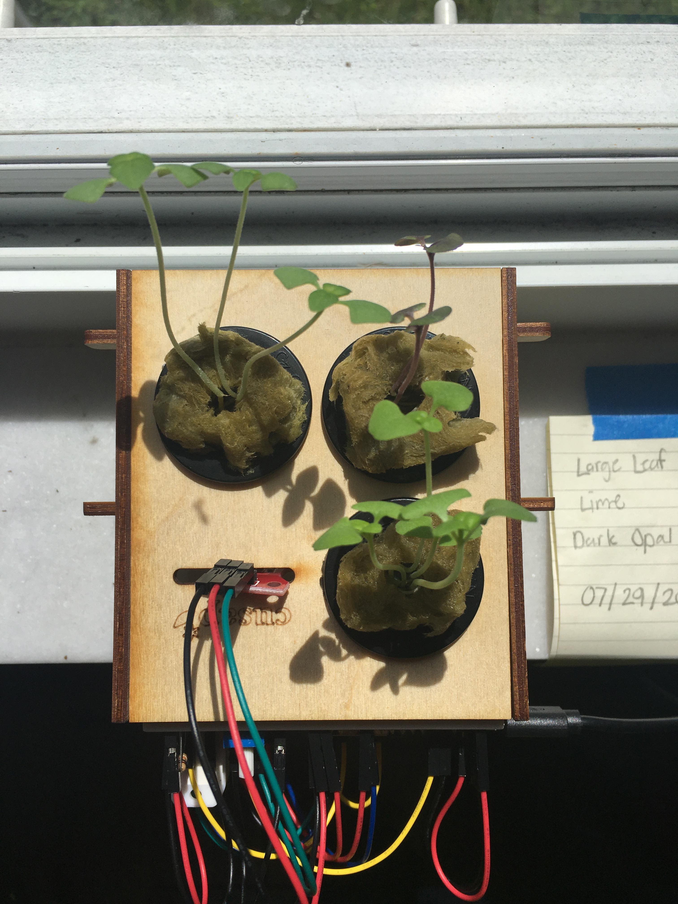
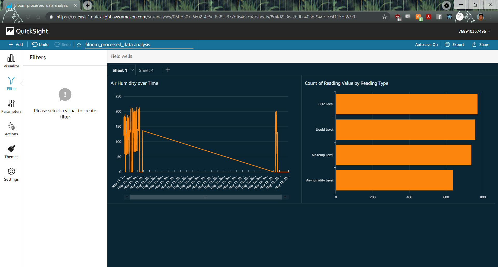
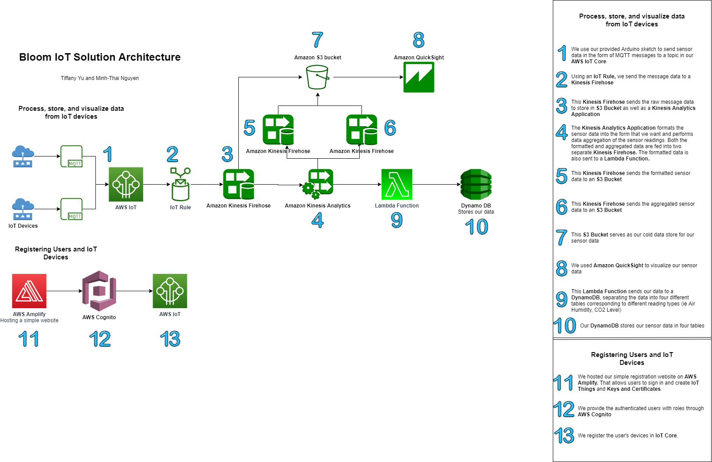

# Bloom IoT Solution in AWS

Bloom is an organization that aspires to make Hydroponic products and systems. This project is a way to monitor our devices using AWS services. With our project, we wanted to provide three essential components: allow users to connect their own IoT devices to our solution; process, format, and analyze the incoming data; and visualize the processed data. We allowed users to connect their devices by providing a website that can be used to generate keys and certificates and create things within our IoT Core. This website is hosted using AWS Amplify and the permissions are provided using AWS Cognito. In addition to this, we provided sample [Arduino code](./example-arduino-sketch-esp8266/esp8266_publisher.ino) for an ESP8266 that publishes messages to a topic within IoT Core. A user can simply use this sample code to create or enhance their own hydroponic systems. In order to process, format, and analyze the incoming data, we built a solution in AWS consisting of IoT rules, Kinesis Firehoses, a Kinesis Analytics application, a lambda function, a DynamoDB database, and an S3 bucket. A more detailed explanation of the data flow can be found in our solution architecture diagram found below. For data visualization we used Amazon QuickSight. A screenshot of our data visualization can be seen below. In it we can see the air humidity readings over time as well as the number of readings per reading type for one system. The straight lines and 0's are due to not having the system up for the entire time.

## Solution Architecture Diagram
Here is our detailed solution architecture diagram in AWS. It details our exact data flow and how we utilized each AWS service.

## Our Presentation

 
The deck for our presentation can be found here: [Deck](./photos/final_presentation_deck.pdf)
